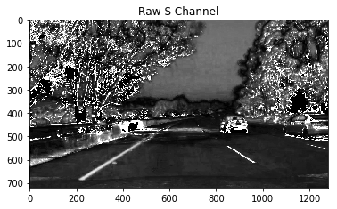
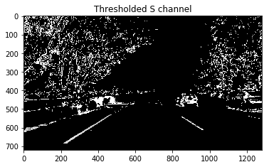
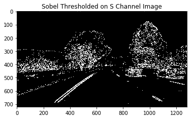
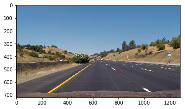
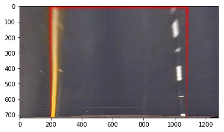
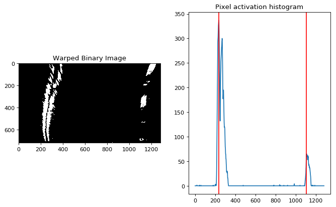

markdown: kramdown


```
from google.colab import drive
drive.mount('/content/drive/')

%cd /content/drive/'My Drive'/'All_Repos'/Self-Driving-Car-NanoDegree/CarND-Advanced-Lane-Lines
```

    Go to this URL in a browser: https://accounts.google.com/o/oauth2/auth?client_id=947318989803-6bn6qk8qdgf4n4g3pfee6491hc0brc4i.apps.googleusercontent.com&redirect_uri=urn%3Aietf%3Awg%3Aoauth%3A2.0%3Aoob&scope=email%20https%3A%2F%2Fwww.googleapis.com%2Fauth%2Fdocs.test%20https%3A%2F%2Fwww.googleapis.com%2Fauth%2Fdrive%20https%3A%2F%2Fwww.googleapis.com%2Fauth%2Fdrive.photos.readonly%20https%3A%2F%2Fwww.googleapis.com%2Fauth%2Fpeopleapi.readonly&response_type=code
    
    Enter your authorization code:
    ··········
    Mounted at /content/drive/
    /content/drive/My Drive/All_Repos/Self-Driving-Car-NanoDegree/CarND-Advanced-Lane-Lines


```
import numpy as np
import cv2
import matplotlib.pyplot as plt
from moviepy.editor import VideoFileClip
from IPython.display import HTML
import glob
%matplotlib inline
```

    Imageio: 'ffmpeg-linux64-v3.3.1' was not found on your computer; downloading it now.
    Try 1. Download from https://github.com/imageio/imageio-binaries/raw/master/ffmpeg/ffmpeg-linux64-v3.3.1 (43.8 MB)
    Downloading: 8192/45929032 bytes (0.0%)3227648/45929032 bytes (7.0%)7299072/45929032 bytes (15.9%)11436032/45929032 bytes (24.9%)15327232/45929032 bytes (33.4%)19382272/45929032 bytes (42.2%)23404544/45929032 bytes (51.0%)27467776/45929032 bytes (59.8%)31498240/45929032 bytes (68.6%)35463168/45929032 bytes (77.2%)39518208/45929032 bytes (86.0%)43532288/45929032 bytes (94.8%)45929032/45929032 bytes (100.0%)
      Done
    File saved as /root/.imageio/ffmpeg/ffmpeg-linux64-v3.3.1.


## Camera Calibration

The main objective of the lane line detection algorithm is to find the lane lines in an image and measure its curvature so that this information can be fed back to the controllers that will then steer the vehicle by a precise angle to account for this curvature in the road ahead. But the image we get from the camera is not always perfect. The camera transforms what it sees in the 3D world into 2D space through some transformation and in doing so it distorts the image. Take a look at the image below. You can notice that the edges of the images are stretched outwards. Since we rely on measurements from the image to place our car in the view, the objects at the edges of the image will appear to be curved and stretched out and hence will give us the wrong measurment if this distortion is not corrected. 


```
fig, ax = plt.subplots(1,2, figsize=(10, 7))
image = 'camera_cal/calibration1.jpg'
img = cv2.imread(image)
img = cv2.cvtColor(img,cv2.COLOR_BGR2RGB)

ax[0].imshow(img) 
ax[0].set_title('Radial Distortion')


image = 'camera_cal/calibration2.jpg'
img = cv2.imread(image)
img = cv2.cvtColor(img,cv2.COLOR_BGR2RGB)

ax[1].imshow(img) 
ax[1].set_title('Tangential Distortion')
plt.show() 
```


## Distortion Correction

There are broadly two types of distortions. The first image above is termed as **radial distortion** where the edges are stretched out or rounded. This is mostly caused because of the fact that the light bends either too much or too little at the edges of the lens causing the objects in the edges to be curved more or less than they actually are. 

The second type of distortion is **tangential distortion** as seen in the second image above. This is uaually caused when the plane of the lens is not aligned with the plane of the image sensor in the camera. In this case the objects appear father away or closer than they actually are.  

In order to correct these two types of distortions, we can use a calibration technique where in we capture standard shapes from the camera and compare its location with an undistorted image. The commonly used pattern for this purpose is a chessboard pattern where we can detect the corners in the image and come up with a transformation that projects the detected corners from the distorted space to the undistorted space. 

<center> </center>

### Radial Distortion Correction

<center>


  
</center>


### Tangential Distortion Correction

<center>
  


  
</center>

These transformation coefficients ( $ k_1, k_2, k_3, p_1, p_2 $) , along with the camera matrix 
<center>


</center>

can then be used to undistort every frame that we extract from the camera feed. Here $c_x and \ c_y $ are principal points which is usually the image center and ***f_x***  and ***f_y*** are the focal length expressed in pixels. The camera matrix is intrinsic to a camera.

\

In oder to get these parameters we can use OpenCV function ```cv2.calibrateCamera``` . This function needs the object points and the image points as inputs. The **object points** are the coordinates of the corners in the undistorted image and **image points** are the actual coordinates as captured by the camera. 

```
ret, mtx, dist, rvecs, tvecs = cv2.calibrateCamera(objpoints, imgpoints, gray.shape[::-1], None, None)

```

To get the image points we can use ```cv2.findChessboardCorners``` function which takes in a gray scale image of the image and returns the coordinates of the corners. 

```
ret, corners = cv2.findChessboardCorners(gray, (8,6), None)
```


Calibration is usually done using more than 20 images taken from the camera. For every image the detected **image points**  are appended to an **image points** array. The **object points** remains the same for all the images. The returned **camera \ matrix** and **distortion \ coefficients** are the used to undistort the image using ```cv2.undistort```

```
undistorted_image = cv2.undistort(img, mtx, dist, None, mtx)
```


```
import pickle
camera_cal = pickle.load( open( "pickle/cal.p", "rb" ) )

mtx = camera_cal["mtx"]
dist = camera_cal["dist"]
```


```
fig, ax = plt.subplots(1,2, figsize=(10, 7))
image = 'camera_cal/calibration1.jpg'
img = cv2.imread(image)
img = cv2.cvtColor(img,cv2.COLOR_BGR2RGB)

ax[0].imshow(img) 
ax[0].set_title('Distorted Image')
dst = cv2.undistort(img, mtx, dist, None, mtx)

ax[1].imshow(dst) 
ax[1].set_title('Distortion Corrected')
plt.show() 
```


## Binary Thresholding

Lane lines can be either yellow or white in color. Instead of the standard RGB color space, HLS color space is more effective in isolating the lane lines. Especially the sturation channel highlights the bright lane lines, compared to the surrounding darker road, better than the other two channels. Hence in this pipeline, the next step will be to convert the image to HLS and use the S channel for lane detection. A sample S channel image is shown below. 


```
image = 'test_images/test5.jpg'
img = cv2.imread(image)
hls = cv2.cvtColor(img, cv2.COLOR_BGR2HLS)
s_channel = hls[:,:,2]
plt.imshow(s_channel,cmap='gray')
plt.title('Raw S Channel')
plt.show()

s_channel[(s_channel > 0) & (s_channel < 160) ] = 0
plt.imshow(s_channel,cmap='gray')
plt.title('Thresholded S channel')
plt.show()

```








The second image above is a thresholded image where the S channel is thresholded such that all pixels below an intesity value of 160 is set to zero. The third image is a binary image created from the thresholded image. Any pixel with an intensity higher than zero is set to one. 

Although this method works well on the test images, when applied to the project video it failed to identify any lines in certain frames. Hence a different approach was used. Instead of thresholding the S_Channel image, the soleb x and sobel y gradients of the S channel were extracted. These gradients are then scaled back so that the values lie in the range [0,255]. This scaled image was thresholded and combined to form the final filtered image. 

For this thresholding, the min and max were set to [10,255]. This helped to reduce all the noise and also retain all the required features in the model. 


```
thresh = [10,255]
image = 'test_images/test1.jpg'
img = cv2.imread(image)
hls = cv2.cvtColor(img, cv2.COLOR_BGR2HLS)
s_channel = hls[:,:,2]
sobelx = cv2.Sobel(s_channel,cv2.CV_64F,1,0,ksize=3)
scaledx = np.abs(255*sobelx/np.max(sobelx)).astype('uint8')
binaryx = np.zeros_like(scaledx)
binaryx[(scaledx > thresh[0]) & (scaledx <= thresh[1])] = 1
sobely = cv2.Sobel(s_channel,cv2.CV_64F,0,1,ksize=3)
scaledy = np.abs(255*sobely/np.max(sobely)).astype('uint8')
binaryy = np.zeros_like(scaledy)
binaryy[(scaledy > thresh[0]) & (scaledy <= thresh[1])] = 1

combined = np.zeros_like(scaledy)
combined[(binaryx == 1) & (binaryy == 1)] =1
plt.imshow(combined,cmap='gray')
plt.title('Sobel Thresholded on S Channel Image')
plt.show()

```





## Perspective Transform

In an image captured by a camera, objects that are farther away from the camera look smaller as cmpared to the ones closer to the camera. Also parallel lane lines appear to converge at a point. This phenomena is caller ***Perspective***. The curvature of the lanes cannot be measured from the raw image directly since the two lines will have different curvatures and doesnt seem to be parallel in this view. Hence this image needs to be projected to a view where the lines appear to be parallel to each other. This projection is called **Perspective Transformation** . 

In order to perform perspective transformation we need to define source and destination points on the raw image and the transformed image. The example images below show the transformation in action


```
img_size = (img.shape[1], img.shape[0])
leftupperpoint  = [585,455]
rightupperpoint = [705,455]
leftlowerpoint  = [190,720]
rightlowerpoint = [1130,720]
    
src = np.float32([leftupperpoint,rightupperpoint,
                  rightlowerpoint,leftlowerpoint])

dst = np.float32([[200,0],[img_size[0]-200,0], [img_size[0]-200,img_size[1]],[200,img_size[1]]])


image = 'test_images/straight_lines1.jpg'
img = cv2.imread(image)
img = cv2.cvtColor(img,cv2.COLOR_BGR2RGB)
pts = np.int32(src).reshape((-1,1,2))
cv2.polylines(img,[pts],True,(255,0,0),1)

undistort = cv2.undistort(img, mtx, dist, None, mtx)

plt.imshow(img)
plt.show()

M = cv2.getPerspectiveTransform(src, dst)
warped = cv2.warpPerspective(undistort, M, img_size)
plt.imshow(warped)
plt.show()
```








## Lane Line Detection

Once we have a warped binary image from the perspective transform, the left and right lines can be detected easily using the image histograms. 
In the image below we can see a plot of the histogram of the activated pixels along the x-axis. There are clearly two peaks indicating the presence of two lane lines. 


```
fig,axs = plt.subplots(1, 2,figsize=(10, 6), dpi=80)
warped = cv2.warpPerspective(combined, M, img_size)
axs[0].imshow(warped,cmap='gray')
axs[0].set_title("Warped Binary Image")

histogram = np.sum(warped[warped.shape[0]//2:,:], axis=0)
midpoint = np.int(histogram.shape[0]//2)
leftx_base = np.argmax(histogram[:midpoint])
rightx_base = np.argmax(histogram[midpoint:]) + midpoint

axs[1].plot(histogram)
axs[1].set_title("Pixel activation histogram")
axs[1].axvline(x=leftx_base,color='r')
axs[1].axvline(x=rightx_base,color='r')
plt.show()
```





But instead of taking the histogram for the whole image, if we can slide a window from the bottom of the image to the top, we can find the base_x values of the left and right lines along the y axis by looking at the point on x axis which has the highest activations. If the number of pixels in this window exceeds a **minpix** value then the center of the window is recomputed. In the image below we can see the sliding window and the base points of each window. We can then fit a second order polynomial to these points and get the left and right lines drawn in yellow below 

<center></center>

<center></center>


## Computing radius of curvature

The radius of curvature of the fitted lines can be computed using the formula
<center>
  


</center>


 
Here A and B are the coefficients of the fitted curve. The equation is evaluated at the lowest part of the image , i.e  y = image.shape[0] in order to get the curvature closest to the vehicle. 

There are two curvature values that we get, the left line curvature and the right line curvature. The two are averaged and the mean radius of curvature of the lane is reported. 

<center>
  

  
  </center>

The distance from the center of the lane is computed by subtracting the lane center from the image center as shown below

<center>


</center>

<center></center>

## Discussion 

While this implementation is much smoother and more accurate than the Lane Line finding project which we implemented [earlier](https://github.com/srikanthadya/CarND-LaneLines-P1/blob/master/writeup.pdf) , there are still some shortcomings. Couple of observations  
 

1.   There is still a slight flicker in the polygon at locations where the lane lines are not seen in the current frame. This probably can be addressed by reproducing the previous lane line where none is found. For shortage of time, that is not implemented in this solution.
2.  The thresholding parameters are not fully tuned yet. The same code on the challenge video performs very poorly since the change in the hue is very marked in that video. Again, this is something I intend to work on at a later stage.
3. The overall run time of the pipeline was also something that prevents it from being able to be used in realtime lane line identification. The video has 25 frames per sec and the processing time for each frame in this code is about 0.2 sec thats about 3 frames per sec. The time taken by the indivudual functions are listed below. Some of these needs to be further optimized to be able to come close to make it real time. But then, the ```VideoFileClip``` funtion that extracts frames from the video file itself takes about 0.25 sec. This is an overhead that we need to live with. 


>> Time taken by perspective_transform 0.009672403335571289\
Time taken by **find_lane_pixels** 0.01395559310913086\
Time taken by fit_poly 0.008010387420654297\
Time taken by search_around_poly 0.048485517501831055\
Time taken by **draw_lanelines** 0.01708698272705078\
Time taken by process_image 0.16254043579101562\
Time taken by threshold_mask 0.051557064056396484\
Time taken by perspective_transform 0.009428977966308594\
Time taken by find_lane_pixels 0.014169931411743164\


```

```
